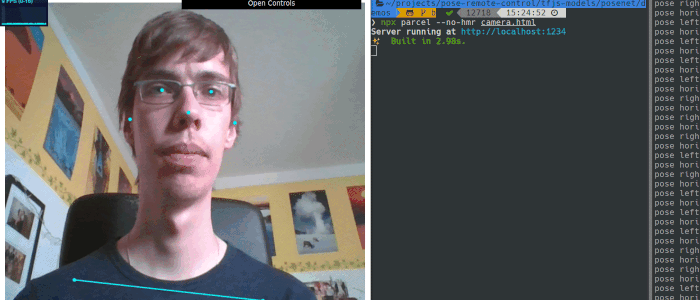

# Pose Remote Control Demo



This is a small gesture control demo I hacked together on an afternoon to show
that you can do something useful and fun with computer vision
as a school project.

In this demo you can switch your virtual desktop by tilting your head to the side.
But you can easily adapt this to anything you can program in Python.
See [my notes](notes.md) for some brainstorming, e.g. how to control VLC media player.

## How it works

There is a Client which does the Gesture Detection using a pretrained PoseNet model
(a neural network). It takes an image from a webam and outputs where certain features
of a face (_landmarks_) are. If the landmarks move in a certain way, a _gesture_ is detected.
For example if the line between your eyes diverges from horizontal by a certain angle.
(Actually it is more like a static _pose_ whereas a gesture would be a transition from
one pose to another.)

The detection event is then sent over a web socket to a Python server which runs
a certain command to switch desktops.

I used the [JavaScript port of TensorFlow](https://github.com/tensorflow/tfjs-models)
because it was really easy get set up: `yarn` and everything just works in the browser.

I touched 4 files:

- `camera.html`: Include socket.io for websocket communication.
- `camera.js`: Implement pose detection as described above and send pose events
  to server via websocket.
- `server.py`: Perform action on received pose event.
- (`client.html`: Test websocket communication.)

While it was easy to set up and the demo had nice visual feedback and some
options built in it had some disadvantages as well: high CPU usage and increased
complexity with the client-server split. Next time I would invest some extra
time to make a Python model work.

## Installation and Usage

Prerequisites:

- Linux desktop with `wmctrl`
- `yarn`
- `python3`

Client:

```sh
# Get this repo including the TensorFlow models submodule
git clone --recurse-submodules https://github.com/hannesfrank/pose-remote-control.git
# Insert my updated code
cp -rf posenet tfjs-models
# Install dependencies
cd tfjs-models/posenet/demos && yarn
# Run
npx parcel --no-hmr camera.html  # hot module replacement does not work with model loading
# Goto localhost:1234
```

Server:
```sh
cd tfjs-models/posenet/demos
python3 -m venv venv
source venv/bin/activate
pip install sanic==20.6.3 python-socketio==4.6.0
python server.py
```

Now tilt your head left/right to switch workspace.
